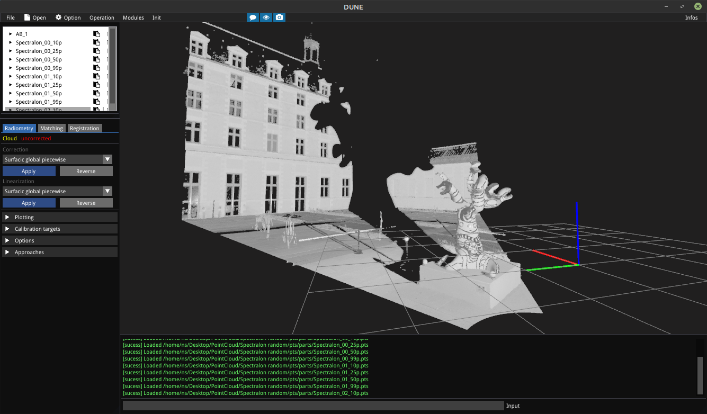

---
title: 'Lidium: a 3D point cloud processing software for TLS LiDAR data'
tags:
  - LiDAR
  - Point cloud
  - Intensity correction and calibration
authors:
  - name: Nathan Sanchiz-Viel^[corresponding author]
    orcid: 0000-0002-4608-5850
    affiliation: 1
affiliations:
 - name: Laboratoire Modélisation, Information et Systèmes (MIS), Université de Picardie Jules Verne (UPJV), 14 quai de la Somme, 80000 Amiens, France
   index: 1
date: 8 June 2021
bibliography: paper.bib

# Summary

LiDAR (Light Detection and Ranging) sensors give huge amount of data, which generally need a variety of post-processing actions. These data are 3D point cloud containing the spatial coordinates and additionnal information like color or intensity of a numerous set of measures. Generally, the main use of these point clouds is the construction of a numerical 3D model of a real scene. The registration of point clouds took from different points of view, for example, is a painful task to achieve and requires usually some specific steps : cloud sampling and filtering, normal computation, just to name a few. But point clouds could also be usefull with the support of the color or intensity information for object detection, material and structure recognition. A radiometric correction of the intensity is necessary to take advantage of this by-product information. Thus, we propose in this software an open source solution for visualization, easy manipulation and processing of point clouds, and some advanced algorithms for 1) radiometric correcttion of the the intensity information, 2) pairwise registration of multiple point cloud using different strategies.

# Statement of need

`Lidium` is designed as a laboratory software to be used by both LiDAR researchers and by geomatic students for the manipulation and algorithm prototyping applied to point cloud data. This software is distinguished of the other open source solutions as CloudCompare (http://www.cloudcompare.org/) or Meshlab (https://www.meshlab.net/) by provinding aa lightweight and hackable framework to LiDAR data visualization and processing, with a focus on the point cloud registration step and the radiometric correction of the intensity information. 

by incorporate reasearch algorithms to radiometric correction the intenisty measured by LiDAR scanner. However, the intensity is scanner-dependant and measure are to be taken with the user specific LiDAR with calirbation targets in order to get advantage from the present algorithms. A corrected intensity could be usefull in a large field of application : autonomous car for obstacle detection, clustering/segmentation, material or structure detection and recognition. The algorithms are described by @sanchiz_2021.

The critical step of the point cloud registration problem is the matching step, wich consist in the identification of correspondences between two point clouds. The corrected intensity, used with keypoint algorithms (SIFT, SHOT, RANSAC) give good results to resolve this problematic stage. An implementation of an ICP based registration pipeline is provided and separated from the matching step. These algorithms are fully adjustable to test parameters and methods. As an alternative solution from proprietary software, we aim to make 3D numerisation a way more accessible.

All of the code is written in C++, for performance purpose. The incorporated external libraries come from the open source world:
-OpenGL: visualization
-ImGui: graphical user interface
-Point Cloud Library (PCL): a set of processing algorithms
-Eigen: linear algebra
-Fast Library for Approximate Nearest Neighbors (FLANN) : to improve the nearest neighbor search speed
-Gnuplot: graphical data visualization

# Acknowledgements

This work was supported by the Agence National de la Recherche (ANR) french institut, Paris, inside the SUMUM project, which aims to improve process and tools for heritage digitization. The authors declare no conflicts of interest.

# References
